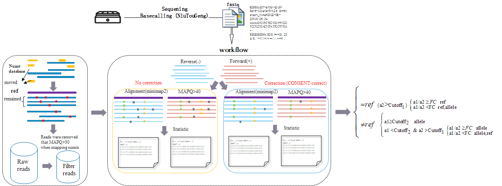

### Overview

&emsp; &emsp; CmVCall is a variant caller of Mitochondrial control region amplicons. 


### CmVCall workflow


#### Step1：

&emsp;Through remove the reads in NUMTS database to drop the Nuclear mitochondria.

#### Step2：

&emsp;Find the previous variants in different stand reads.

#### Step3：

&emsp;According to statistic analysis to confirm the final variant sites and output the genotypes.

### Python environment construction and required software installation

```
   conda create -n CmVCall python==3.8.0
   conda activate CmVCall
   conda config --add channels bioconda 
   conda config --add channels
```


### CmVCall installation
```
   git clone https://github.com/willow2333/CmVCall.git
   cd CmVCall
   conda install --yes --file requirements.txt
   python cmvcall.py --h
   
  usage: cmvcall.py [-h] [--input INPUT] [--cinput CINPUT] [--CORRECT CORRECT] [--a1 A1] [--a2 A2] [--FC FC] [--depth DEPTH]

   optional arguments:
     -h, --help         show this help message and exit
     --input INPUT      The path of files like *fq.gz.
     --cinput CINPUT    The path of CmVCall download
     --CORRECT CORRECT  IF you want to correct the raw reads please choose "yes" else "no", default yes!
     --a1 A1            The frequency of the first allele
     --a2 A2            The frequency of the second allele
     --FC FC            The ratio of a1/a2
     --depth DEPTH      The depth of the least reads.

```

###  Illustration
#### 1.Test
```
   python cmvcall.py --input test/ --cinput ${path}/CmVCall --CORRECT yes  --FC 32
```

#### 2. Output
&emsp;The analysis results of variants is in filter_variants.txt


© 2023 by  Yiping Hou (forensic@scu.edu.cn), Zheng Wang (wangzhengtim@scu.edu.cn), Liu Qin (ql_willow@163.com)

